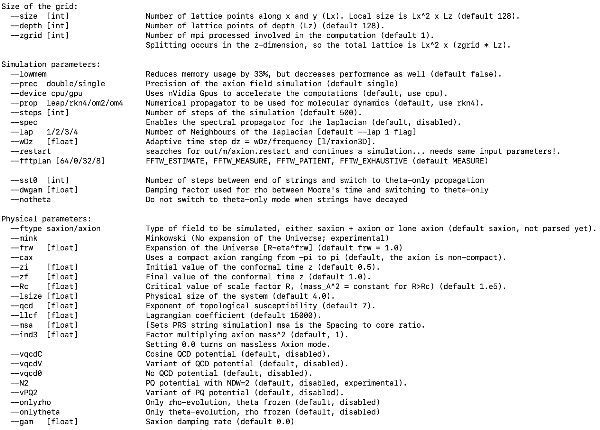
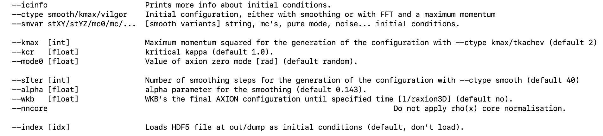

1. TOC
{:toc}
{: .highlight}

## Summary 

Jaxions is a modular code that allows the user to create a custom program, however there are five different programs already implemented to use the various different features:

- `vaxion3d`: this is the **main** program to solve Klein-Gordon eqaution for the complex field or the real scalar and allowing several initial conditions and physical characteristics. 
- `WKVaxion`: this is the program that evaluates the grid with a WKB approximation to a given time/redshift.
- `paxion`: this program transforms the **real scalar field** into a complex wavefunction and continues the evolution with the Schroedinger-Poisson equations.
- `redu`: this program reduces the resolution and saves the new grid. 
- `gadgetme`: this program creates an HDF5 particle configuration compatible with gadget-4.

`mpirun -np <num_cores> /path/to/vaxion3d {runtime options}`
{: .highlight} 

Before launching a simulation the chosen parameters, such as lattice size, final simulation time, etc., can be checked with the python utility in `scripts/params.py`, see [here]().
{: .note}

### An example script

An example bash script is provided in `jaxionsdir/jaxions/scripts/vax-ex.sh` and can be seen here: 


```bash
N=256 ; RANKS=4 ; DEPTH=$(echo $N/$RANKS | bc)
GRID=" --size $N --depth $DEPTH --zgrid $RANKS"
LOW=" --lowmem" ; PREC=" --prec single" ; DEVI=" --device cpu"
PROP=" --prop rkn4" ; SPEC=" --spec"
STEP=20000 ; WDZ=1.0 ; SST0=10 ; LAP=1
SIMU=" $PREC $DEVI $PROP --steps $STEP --wDz $WDZ --sst0 $SST0 --lap $LAP"
QCD=4.0 ; MSA=1.00 ; L=6.0 ; ZEN=4.0 ;
PHYS="--qcd $QCD --msa $MSA --lsize $L --zf $ZEN $XTR"
INCO=" --ctype smooth --kcr 1.1 --sIter 5 "
DUMP=10 ; WTIM=1.0 ;
MEAS=$(echo 1+2+4+8+32+128+65536+16384 | bc )
SPMA=$(echo 1 | bc )
SKGV=$(echo 1 | bc )
OUTP="--dump $DUMP --meas $MEAS ---spmask $SPMA --spKGV $SKGV --nologmpi --wTime $WTIM "
export OMP_NUM_THREADS=4
mpirun $USA -np $RANKS vaxion3d $GRID $SIMU $PHYS $INCO $OUTP
```


## Runtime options

### Grid and evolution
<details>
<summary>Reference for the simulation parameters</summary>



</details>

### Initial conditions

<details>
<summary>Reference for the intial conditions</summary>



</details>

### Optimisations

To ensure an efficient hybrid parallelistation a careful choice of MPI processes and OpenMP threads needs to be implemented. 
