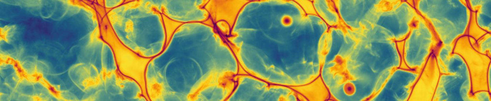

<script
  src="https://cdn.mathjax.org/mathjax/latest/MathJax.js?config=TeX-AMS-MML_HTMLorMML"
  type="text/javascript">
</script>



# Jaxions
{: .fs-9 }

A grid-based massively parallel code to study the Axion field evolution before, around and after the QCD phase transition
{: .fs-6 .fw-300 }

[View it on GitHub][Jaxions repo]{: .btn}

## Overview 

- Axion string simulations to calculate emission spectra
- String-Wall network simulations with $N=1$, $N=2$
- Generalisation to axion-like-particles 
- Interface with [AxionNyx][AxioNyx repo] and [gagdet-4][gadget4 repo] 

## Obtain the code

To download the source code from the public repository use:

```
git clone https://github.com/veintemillas/jaxions.git
```

## Documentation

A detailed pdf version of the documentation is under development. For reference on the physics implemented, please also refer to the papers.

## Papers using jaxions 
- *A. Vaquero, J. Redondo, J. Stadler*, Early seeds of axion miniclusters, [1809.09241](https://arxiv.org/abs/1809.09241)
- *B. Eggemeier, J. Redondo, K. Dolag, J. Niemeyer, A. Vaquero*, First Simulations of Axion Minicluster Halos, [1911.09417](https://arxiv.org/abs/1911.09417)
- *C. O'Hare, G.Pierobon, J. Redondo, Y. Wong*, Simulations of axionlike particles in the post-inflationary scenario, [2112.05117](https://arxiv.org/abs/2112.05117)
- *B. Eggemeier, C. O'Hare, G.Pierobon, J. Redondo, Y. Wong*, Axion minivoids and implications for direct detection, [2212.00560](https://arxiv.org/abs/2212.00560)
  {: .d-inline-block }
  New  
  {: .label .label-green}


[Jaxions repo]: https://github.com/veintemillas/jaxions/
[gadget4 repo]: https://wwwmpa.mpa-garching.mpg.de/gadget4/
[AxioNyx repo]: https://github.com/axionyx/axionyx_1.0
